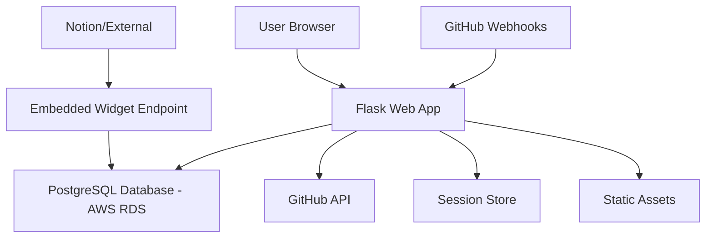

# Design Document

## Overview

Git-Done is a Flask-based web application that provides deadline-driven productivity tracking for developers through GitHub integration. The system consists of a main web application for goal management and lightweight embeddable widgets for external platforms like Notion. The architecture emphasizes simplicity, security, and real-time updates while maintaining the minimalist aesthetic defined in the project guidelines.

## Architecture

### System Components



### High-Level Flow

1. **Authentication Flow**: User authenticates via GitHub OAuth2, session stored server-side
2. **Goal Creation**: User creates goals, system validates repo access and sets up webhooks
3. **Real-time Tracking**: Frontend JavaScript updates countdowns every second
4. **Webhook Processing**: GitHub sends events, system processes and updates goal status
5. **Embedded Widgets**: External platforms load minimal countdown widgets via dedicated endpoints

## Components and Interfaces

### Backend Components

#### 1. Authentication Module (`auth.py`)
- **Purpose**: Handle GitHub OAuth2 flow and session management
- **Key Functions**:
  - `initiate_github_oauth()`: Redirect to GitHub authorization
  - `handle_oauth_callback()`: Process OAuth callback and store tokens
  - `get_current_user()`: Retrieve authenticated user from session
  - `logout_user()`: Clear session and redirect

#### 2. Goal Management Module (`goals.py`)
- **Purpose**: CRUD operations for goals and webhook management
- **Key Functions**:
  - `create_goal()`: Validate and create new goals with webhook setup
  - `get_user_goals()`: Retrieve goals for authenticated user
  - `delete_goal()`: Remove goal and associated webhook
  - `setup_webhook()`: Create GitHub webhook for repository

#### 3. Webhook Handler Module (`webhooks.py`)
- **Purpose**: Process GitHub webhook events and update goal status
- **Key Functions**:
  - `verify_webhook_signature()`: Validate GitHub webhook authenticity
  - `process_push_event()`: Check commits for completion conditions
  - `process_issues_event()`: Check issue closures for completion
  - `process_pull_request_event()`: Check PR merges for completion
  - `complete_goal()`: Update goal status and timestamp

#### 4. Embedded Widget Module (`embed.py`)
- **Purpose**: Serve lightweight countdown widgets for external embedding
- **Key Functions**:
  - `render_embedded_widget()`: Generate minimal HTML for embedding
  - `get_widget_data()`: Return JSON data for widget updates
  - `validate_embed_request()`: Security validation for embed requests

### Frontend Components

#### 1. Main Application (`static/js/app.js`)
- **Purpose**: Full-featured dashboard for goal management
- **Key Classes**:
  - `GitDoneApp`: Main application controller
  - `GoalManager`: Handle goal CRUD operations
  - `CountdownTimer`: Real-time countdown functionality
  - `AuthHandler`: Manage authentication state

#### 2. Embedded Widget (`static/js/embed.js`)
- **Purpose**: Minimal JavaScript for embedded countdown widgets
- **Key Functions**:
  - `EmbeddedCountdown`: Lightweight countdown timer
  - `updateFromAPI()`: Fetch latest goal data
  - `renderMinimalUI()`: Display countdown without navigation

### Database Schema

#### Goals Table
```sql
CREATE TABLE goals (
    id INTEGER PRIMARY KEY AUTOINCREMENT,
    user_github_id VARCHAR(100) NOT NULL,
    github_username VARCHAR(100) NOT NULL,
    description VARCHAR(200) NOT NULL,
    deadline DATETIME NOT NULL,
    repo_url VARCHAR(500) NOT NULL,
    repo_owner VARCHAR(100) NOT NULL,
    repo_name VARCHAR(100) NOT NULL,
    completion_condition VARCHAR(200) NOT NULL,
    completion_type ENUM('commit', 'issue', 'pull_request') NOT NULL,
    status ENUM('active', 'completed', 'overdue') DEFAULT 'active',
    webhook_id INTEGER,
    created_at DATETIME DEFAULT CURRENT_TIMESTAMP,
    completed_at DATETIME,
    embed_token VARCHAR(32) UNIQUE NOT NULL
);
```

#### Users Table
```sql
CREATE TABLE users (
    github_id VARCHAR(100) PRIMARY KEY,
    username VARCHAR(100) NOT NULL,
    access_token VARCHAR(255) NOT NULL,
    avatar_url VARCHAR(500),
    created_at DATETIME DEFAULT CURRENT_TIMESTAMP,
    last_login DATETIME
);
```

## Data Models

### Goal Model
```python
class Goal(db.Model):
    # Core fields
    id = db.Column(db.Integer, primary_key=True)
    user_github_id = db.Column(db.String(100), nullable=False)
    description = db.Column(db.String(200), nullable=False)
    deadline = db.Column(db.DateTime, nullable=False)
    
    # Repository information
    repo_url = db.Column(db.String(500), nullable=False)
    repo_owner = db.Column(db.String(100), nullable=False)
    repo_name = db.Column(db.String(100), nullable=False)
    
    # Completion tracking
    completion_condition = db.Column(db.String(200), nullable=False)
    completion_type = db.Column(db.Enum('commit', 'issue', 'pull_request'), nullable=False)
    status = db.Column(db.Enum('active', 'completed', 'overdue'), default='active')
    
    # Webhook and embedding
    webhook_id = db.Column(db.Integer)
    embed_token = db.Column(db.String(32), unique=True, nullable=False)
    
    # Timestamps
    created_at = db.Column(db.DateTime, default=datetime.utcnow)
    completed_at = db.Column(db.DateTime)
    
    def is_overdue(self):
        return datetime.utcnow() > self.deadline and self.status == 'active'
    
    def time_remaining(self):
        if self.status == 'completed':
            return timedelta(0)
        remaining = self.deadline - datetime.utcnow()
        return max(remaining, timedelta(0))
    
    def generate_embed_url(self):
        return f"/embed/{self.embed_token}"
```

### User Model
```python
class User(db.Model):
    github_id = db.Column(db.String(100), primary_key=True)
    username = db.Column(db.String(100), nullable=False)
    access_token = db.Column(db.String(255), nullable=False)
    avatar_url = db.Column(db.String(500))
    created_at = db.Column(db.DateTime, default=datetime.utcnow)
    last_login = db.Column(db.DateTime)
    
    goals = db.relationship('Goal', backref='user', lazy=True, 
                           foreign_keys='Goal.user_github_id')
```

## Error Handling

### Authentication Errors
- **OAuth Failures**: Redirect to login with error message
- **Token Expiration**: Refresh tokens or re-authenticate
- **Invalid Sessions**: Clear session and redirect to login

### GitHub API Errors
- **Rate Limiting**: Implement exponential backoff and user notification
- **Repository Access**: Validate permissions before webhook creation
- **Webhook Failures**: Log errors and provide manual retry options

### Webhook Security
- **Signature Verification**: Validate all webhook payloads using GitHub's signature
- **Replay Attacks**: Implement timestamp validation and nonce tracking
- **Invalid Payloads**: Log suspicious requests and return appropriate HTTP codes

### Embedded Widget Security
- **Token Validation**: Verify embed tokens before serving widgets
- **CORS Configuration**: Restrict origins to known embedding platforms
- **Rate Limiting**: Prevent abuse of embed endpoints

## Testing Strategy

### Unit Tests
- **Models**: Test Goal and User model methods and validations
- **Webhook Processing**: Test completion condition matching logic
- **Authentication**: Test OAuth flow and session management
- **Embed Tokens**: Test token generation and validation

### Integration Tests
- **GitHub API**: Test webhook creation and repository validation
- **Database Operations**: Test CRUD operations with real database
- **End-to-End Flows**: Test complete user journeys from login to goal completion

### Frontend Tests
- **Countdown Logic**: Test timer accuracy and state management
- **API Integration**: Test frontend-backend communication
- **Embedded Widgets**: Test widget functionality in isolation

### Security Tests
- **Webhook Verification**: Test signature validation with various payloads
- **Session Security**: Test session hijacking prevention
- **Input Validation**: Test SQL injection and XSS prevention
- **Embed Security**: Test unauthorized access to embed endpoints

## Performance Considerations

### Database Optimization
- **Indexing**: Index on user_github_id, status, and deadline columns
- **Query Optimization**: Use efficient queries for goal retrieval
- **Connection Pooling**: Implement connection pooling for concurrent requests

### Frontend Performance
- **Asset Minification**: Minify CSS and JavaScript for production
- **Caching**: Implement browser caching for static assets
- **Lazy Loading**: Load goal data progressively for large lists

### Embedded Widget Performance
- **Minimal Payload**: Serve only essential data for embedded widgets
- **CDN Integration**: Serve static assets from CDN for faster loading
- **Compression**: Enable gzip compression for all responses

## Deployment Architecture

### Production Environment
- **Web Server**: Gunicorn with multiple workers
- **Reverse Proxy**: Nginx for static file serving and SSL termination
- **Database**: PostgreSQL on AWS RDS with automated backups
- **Environment Variables**: Secure storage of GitHub OAuth credentials

### Security Configuration
- **HTTPS Only**: Force HTTPS for all connections
- **Secure Headers**: Implement security headers (CSP, HSTS, etc.)
- **Secret Management**: Use environment variables for sensitive data
- **Webhook Endpoints**: Validate all incoming webhook requests